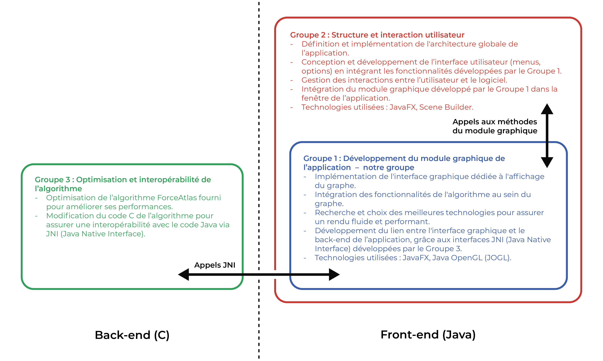

# Projet PSTL - Module graphique

## Introduction

L’objectif de ce projet est de développer une interface graphique similaire à celle de Gephi, permettant à l’utilisateur d’interagir et de modifier les paramètres d’un graphe en temps réel, même pendant l’affichage dynamique. Ce projet se distingue de Gephi de par l’utilisation de l'algorithme ForceAtlas2 développé en C et fourni par l’un de nos encadrants, Olivier Bodini.

Cette branche contient le code source du module graphique de l’application, à savoir la partie du groupe 1, ainsi que ses dépendances (notamment l'optimisation de l'algorithme de ForceAtlas2 réalisée par le groupe 3). Le module graphique est développé en JavaFX et utilise la librairie JOGL pour le rendu OpenGL. Il est conçu pour fonctionner avec l'algorithme ForceAtlas2, qui est implémenté en C et accessible via JNI (Java Native Interface). L'application complète (intégrée dans une interface utilisateur conçue par le groupe 2) est accessible dans la branche `main` du dépôt [damrib/PSTL_25_visualisation_graphes](https://github.com/damrib/PSTL_25_visualisation_graphes).

## Installation et exécution

1. Télécharger [JavaFX](https://gluonhq.com/products/javafx/) et le décompresser dans le dossier `lib` du projet.
2. Ajouter le dossier `lib/javafx-sdk-X/lib` (avec `X` la version de JavaFX) et le contenu de `lib/jogl` dans les librairies du projet.
3. Adapter le fichier `Makefile` en ajustant `JAVAFX_DIR` (le chemin vers le dossier de JavaFX) si nécessaire avec la version de JavaFX que vous avez téléchargée.
4. Compiler et exécuter le projet avec la commande `make`.

## Utilisation

Lors de la simulation du graphe, vous pouvez interagir avec le graphe à travers différents états :
- **RUN** (accessible en cliquant sur la touche `1` du clavier) :
  - L'utilisateur ne peut réaliser aucune action mais visualise en temps réel la progression
- **SELECTION** (accessible en cliquant sur la touche `2` du clavier) :
  - Un simple clic sur un sommet permet d’obtenir des informations sur celui-ci (son identifiant et ses coordonnées)
  - Un appui prolongé de type drag and drop sur un sommet permet son déplacement
- **MOVE** (accessible en cliquant sur la touche `3` du clavier) :
  - L’utilisateur peut se déplacer dans le graphe en maintenant le clic gauche de la souris enfoncé
  - L'utilisateur peut zoomer/dézoomer en utilisant la molette de la souris
- **DELETE** (accessible en cliquant sur la touche `4` du clavier) :
  - L'utilisateur peut supprimer un sommet en cliquant dessus avec le bouton gauche de la souris

De plus, l'utilisateur peut également appliquer une option de filtrage sur le graphe :
- **Masquer les sommets dont le dégré vaut 0** (accessible en cliquant sur la touche `5` du clavier)
- **Réafficher les sommets masqués** (accessible en recliquant sur la touche `5` du clavier)

Enfin, l'utilisateur peut générer une image PNG du graphe en cours d'affichage (centré et zoomé sur la zone d'affichage) :
- **Générer une image PNG identique à l'affichage** sans amélioration esthétique (accessible en cliquant sur la touche `6` du clavier)
- **Générer une image PNG optimisée** (accessible en cliquant sur la touche `7` du clavier) :
  - L'image PNG générée est optimisée avec une meilleure résolution, l'utilisation de courbes de Bézier pour les arêtes, l'ajout de bordures aux sommets et un meilleur rendu des arêtes et des sommets

## Auteurs

ARNOULD Yann, BELKADI Selma, DURBIN Deniz Ali, FAGBEHOURO Awwal, FLAN Bih, RIBEIRO Damien, TAUCH Ryan, ZIBOUCHE Hamid

## Encadrants

M. BODINI Olivier, M. NAIMA Mehdi